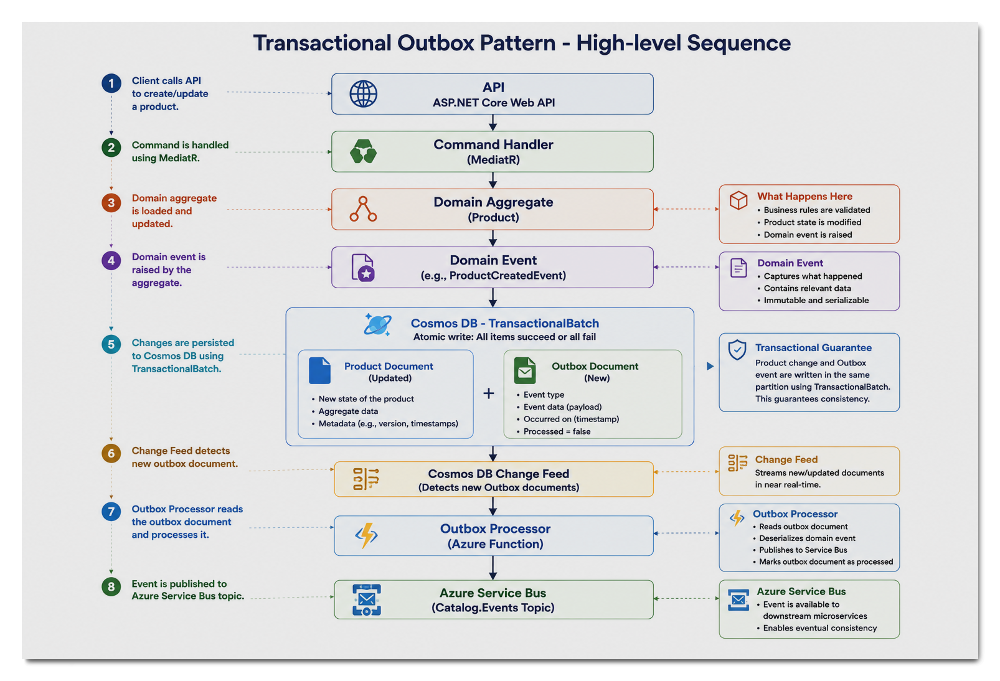
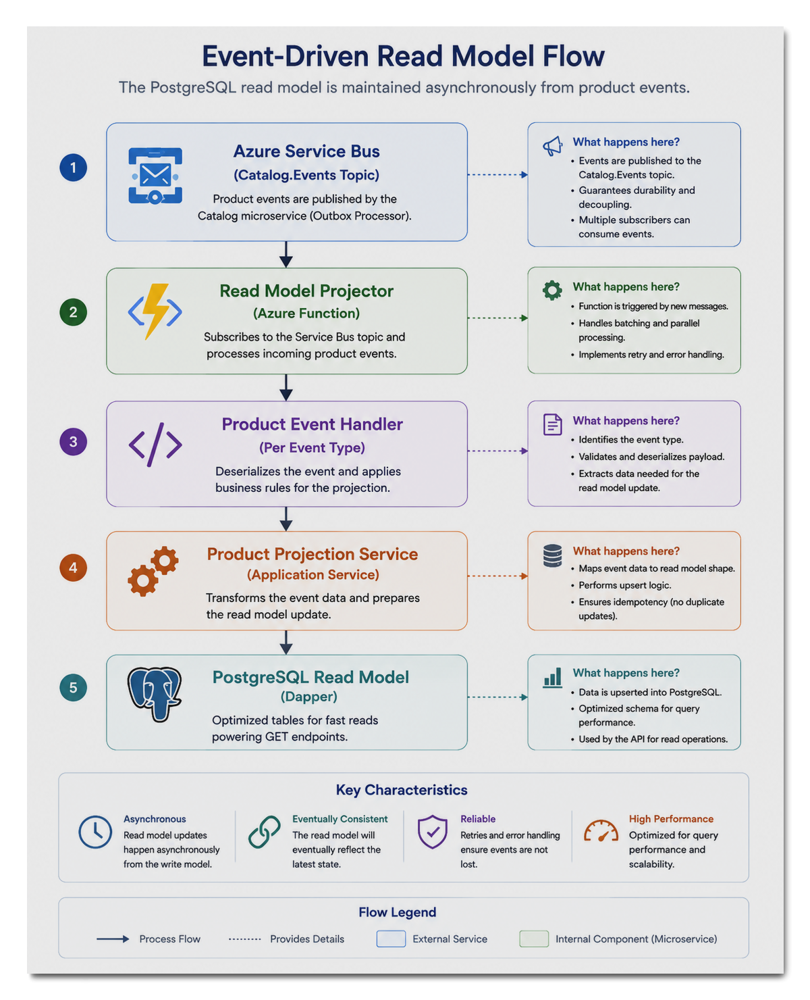

# CLWebStore.Catalog

Cloud-native Product Catalog microservice built with **.NET 10**,
**ASP.NET Core**, **Domain-Driven Design (DDD)**, **CQRS**, and an
**event-driven architecture** using the **Transactional Outbox
Pattern**.

The project is designed as a public engineering portfolio demonstrating
modern enterprise software architecture and engineering practices, with
an emphasis on maintainability, scalability, eventual consistency,
observability, and separation of concerns.

## High-Level Architecture

The following diagram provides an overview of the microservice
architecture, its internal layers, and the event-driven pipeline used to
maintain the PostgreSQL read model.


## Architecture at a Glance

CLWebStore.Catalog follows a layered Clean Architecture approach:

-   **API Layer** --- exposes versioned HTTP endpoints through ASP.NET
    Core.
-   **Application Layer** --- implements CQRS using MediatR, application
    commands, queries, handlers, validation, and cross-cutting
    behaviors.
-   **Domain Layer** --- contains the Product aggregate, entities, value
    objects, domain events, and core business rules.
-   **Infrastructure Layer** --- implements persistence, repositories,
    query services, Cosmos DB integration, PostgreSQL queries,
    configuration, and observability.
-   **Outbox Processor** --- an Azure Function that reads committed
    outbox events from the Cosmos DB change feed and publishes them to
    Azure Service Bus.
-   **Read Model Projector** --- an Azure Function that consumes product
    events from Azure Service Bus and asynchronously updates the
    PostgreSQL read model.
-   **Unit Tests** --- xUnit/Moq tests covering the implemented API,
    application, domain, infrastructure, Outbox Processor, and Read
    Model Projector behavior.

This separation keeps business logic independent from infrastructure
concerns while allowing the read and write workloads to scale
independently.

## Core Architectural Patterns

### Domain-Driven Design

The Product Catalog bounded context is modeled around a `Product`
aggregate.

The domain layer contains:

-   `Product` aggregate root
-   `ProductImage` entity
-   `Money` value object
-   `ProductName` value object
-   `Sku` value object
-   Domain events such as `ProductCreatedEvent` and
    `ProductUpdatedEvent`
-   Domain primitives including `Entity`, `AggregateRoot`,
    `ValueObject`, and `IDomainEvent`

The domain model is intentionally isolated from persistence and
application concerns.

### CQRS

The service separates write and read responsibilities.

**Commands** modify the Product aggregate:

-   `CreateProductCommand`
-   `UpdateProductCommand`

**Queries** retrieve product data:

-   Get product by ID
-   Get products by category
-   Get product by SKU
-   Get related products
-   Search products

MediatR provides the application-level request/handler pipeline.

### Transactional Outbox Pattern

Product changes and their corresponding outbox events are persisted to
Cosmos DB as part of the same transactional operation.

This avoids the classic distributed consistency problem where a database
transaction succeeds but publishing the corresponding integration event
fails.

The high-level sequence is:

``` text
API
  │
  ▼
Command Handler
  │
  ▼
Domain Aggregate
  │
  ├── Product change
  │
  └── Domain event
        │
        ▼
   Cosmos DB
   TransactionalBatch
        │
        ├── Product document
        └── Outbox document
              │
              ▼
       Cosmos DB Change Feed
              │
              ▼
       Outbox Processor
              │
              ▼
       Azure Service Bus
```

### Event-Driven Read Model

The PostgreSQL read model is maintained asynchronously from product
events.

``` text
Azure Service Bus
        │
        ▼
Read Model Projector
        │
        ▼
Product Event Handler
        │
        ▼
Product Projection Service
        │
        ▼
PostgreSQL Read Model
```

This allows the write model and read model to evolve and scale
independently.

## Request and Data Flow

### Write Flow

1.  A client sends an HTTP request to the versioned Products API.
2.  The API validates and maps the request.
3.  The command is dispatched through MediatR.
4.  Validation, logging, and tracing behaviors execute through the
    MediatR pipeline.
5.  The command handler operates on the Product aggregate.
6.  The repository persists the aggregate and its outbox event to Cosmos
    DB using the transactional outbox approach.
7.  The transaction completes successfully.
8.  The Cosmos DB change feed makes the outbox message available to the
    Outbox Processor.
9.  The Outbox Processor publishes the event to Azure Service Bus.

### Read Flow

1.  A client sends a product query to the API.
2.  The query is dispatched through MediatR.
3.  The query handler uses the product query service.
4.  Dapper queries the PostgreSQL read model.
5.  The resulting projection is mapped to the appropriate API DTO.
6.  The API returns the response to the client.

Reads therefore do not require loading the Product domain aggregate.

## Event-Driven Integration

The microservice contains two Azure Functions that form the asynchronous
integration pipeline.

### Outbox Processor

`CLWebStore.Catalog.OutboxProcessor`

The Outbox Processor:

-   Monitors the Cosmos DB change feed.
-   Identifies outbox messages.
-   Publishes integration events to Azure Service Bus.
-   Uses a dead-letter store for messages that cannot be successfully
    processed.
-   Separates event publishing from the API request lifecycle.



### Read Model Projector

`CLWebStore.Catalog.ReadModelProjector`

The Read Model Projector:

-   Listens to the Azure Service Bus topic.
-   Dispatches product events to the appropriate event handler.
-   Handles product-created and product-updated events.
-   Projects product data into PostgreSQL.
-   Uses Npgsql for PostgreSQL connectivity.
-   Stores nested product image data using JSONB-compatible data.



## Persistence

### Cosmos DB --- Write Model

Cosmos DB is the persistence store for the Product aggregate and
transactional outbox documents.

The infrastructure layer contains document representations including:

-   `ProductDocument`
-   `ProductImageDocument`
-   `OutboxDocument`
-   `BaseDocument`

Repository access is implemented through `ProductRepository`.

### PostgreSQL --- Read Model

PostgreSQL serves as the CQRS read model.

The application uses Dapper for efficient query execution through
`ProductQueryService`.

The read side is optimized for query workloads rather than domain
modeling, allowing API queries to retrieve projection-shaped data
without reconstructing domain aggregates.

## Cross-Cutting Concerns

The application includes MediatR pipeline behaviors for:

-   **Validation** --- FluentValidation-based request validation.
-   **Logging** --- application-level request/operation logging.
-   **Tracing** --- distributed tracing instrumentation.

The API also includes:

-   API versioning
-   Global exception handling
-   AutoMapper-based mapping
-   OpenAPI support
-   Configuration integration

## Observability

OpenTelemetry is used for application observability and tracing.

The solution contains dedicated diagnostics and activity-source
components, including:

-   `CatalogApplicationDiagnostics`
-   `ActivitySources`
-   Read Model Projector diagnostics

The architecture is designed to provide visibility across the
synchronous API request path and asynchronous event-driven pipeline.

## Configuration and Cloud Services

The solution includes integration points for:

-   Azure App Configuration
-   Azure Key Vault
-   Azure Cosmos DB
-   Azure Service Bus
-   PostgreSQL
-   Azure Functions

Configuration is kept outside application code and is represented
through strongly typed options where appropriate.

## Solution Structure

The solution is organized under `src/` with a separate `tests/`
hierarchy.

``` text
CLWebStore.Catalog/
├── src/
│   ├── CLWebStore.Catalog.API/
│   ├── CLWebStore.Catalog.Application/
│   ├── CLWebStore.Catalog.Domain/
│   ├── CLWebStore.Catalog.Infrastructure/
│   ├── CLWebStore.Catalog.OutboxProcessor/
│   └── CLWebStore.Catalog.ReadModelProjector/
│
├── tests/
│   └── CLWebStore.Catalog.UnitTests/
│
└── CLWebStore.Catalog.slnx
```

### API

Contains HTTP-facing concerns:

-   Versioned controllers
-   Request and response contracts
-   API mappings
-   Global exception handling
-   Application startup and configuration

### Application

Contains use cases and application orchestration:

-   Commands
-   Queries
-   Handlers
-   Validators
-   DTOs
-   MediatR behaviors
-   Application abstractions
-   Application mappings
-   Application diagnostics

### Domain

Contains the business model:

-   Aggregates
-   Entities
-   Value objects
-   Domain events
-   Domain primitives and exceptions

### Infrastructure

Contains implementation details:

-   Cosmos DB persistence
-   Repository implementation
-   PostgreSQL query services
-   SQL query definitions
-   Configuration
-   Logging
-   Tracing
-   Dependency injection

### Outbox Processor

Contains the Azure Function responsible for moving committed outbox
events from Cosmos DB into Azure Service Bus.

### Read Model Projector

Contains the Azure Function responsible for consuming product events and
projecting them into PostgreSQL.

### Unit Tests

The current automated testing implementation is **unit testing only**.

The tests project uses:

-   **xUnit**
-   **Moq**

Unit tests cover implemented behavior across:

-   API controllers
-   API mappings
-   Global exception handling
-   Command handlers
-   Validators
-   Query handlers
-   Domain aggregates
-   Domain entities
-   Value objects
-   Infrastructure mappings
-   Query services
-   Repository behavior
-   Outbox Processor functions and services
-   Read Model Projector dispatching, handlers, functions, and
    projection services

Integration, Pact/contract, and end-to-end testing are planned for
future iterations and are intentionally not represented as currently
implemented capabilities.

## Technology Stack

| Area | Technology |
| :--- | :--- |
| Runtime | .NET 10 |
| Language | C# |
| API | ASP.NET Core |
| Architecture | Clean Architecture, DDD, CQRS |
| Application Mediation | MediatR |
| Validation | FluentValidation |
| Mapping | AutoMapper |
| Write Database | Azure Cosmos DB |
| Write Database Access | Azure Cosmos DB .NET SDK |
| Read Database | PostgreSQL |
| Read Data Access | Dapper / Npgsql |
| Messaging | Azure Service Bus |
| Background Processing | Azure Functions |
| Outbox | Transactional Outbox Pattern |
| Configuration | Azure App Configuration |
| Secrets | Azure Key Vault |
| Observability | OpenTelemetry |
| Unit Testing | xUnit / Moq |

## Engineering Principles

The project emphasizes:

-   Domain-Driven Design
-   Clean Architecture
-   CQRS
-   Event-Driven Architecture
-   Transactional Outbox Pattern
-   Separation of concerns
-   Asynchronous processing
-   Eventual consistency
-   Independent read/write scaling
-   Production-oriented observability
-   Maintainable and testable code

## Current Testing Status

| Test Type | Status |
| :--- | :--- |
| Unit Tests | Implemented |
| Integration Tests | Planned |
| Pact / Contract Tests | Planned |
| End-to-End Tests | Planned |

The distinction is intentional: the architecture is designed with
broader testing strategies in mind, but only unit testing has been
implemented at this stage.

## Project Goals

CLWebStore.Catalog is intended not only to provide Product Catalog
functionality, but also to demonstrate practical application of modern
software engineering techniques in a realistic cloud-native
microservice.

The project focuses on building a system that is:

-   Maintainable
-   Testable
-   Observable
-   Resilient
-   Scalable
-   Loosely coupled
-   Suitable for asynchronous distributed processing

---

## License

Internal project for the CLWebStore platform.
