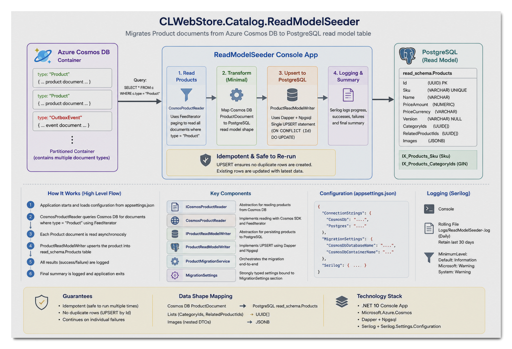

# CLWebStore.Catalog.ReadModelSeeder

`CLWebStore.Catalog.ReadModelSeeder` is a .NET 10 console application that migrates Product documents from Azure Cosmos DB into a PostgreSQL CQRS read model.

The utility is intended to bootstrap or rebuild the PostgreSQL read model from the authoritative Product data stored in Cosmos DB. The migration process is fully idempotent, allowing the utility to be executed multiple times without creating duplicate records.

---

## High-Level Architecture



The application reads Product documents from a Cosmos DB container, transforms them into the PostgreSQL read model format, and persists them using PostgreSQL UPSERT semantics.

Only documents with a `type` value of `Product` are processed. Other document types, such as `OutboxEvent`, are ignored.

### Migration Flow

1. Application configuration is loaded from `appsettings.json`.
2. `CosmosProductReader` queries Cosmos DB for Product documents.
3. Product documents are read asynchronously using the Cosmos SDK `FeedIterator`.
4. `ProductMigrationService` orchestrates the migration process.
5. `ProductReadModelWriter` persists each Product into PostgreSQL.
6. PostgreSQL performs an UPSERT using `ON CONFLICT (Id) DO UPDATE`.
7. Serilog records migration progress, successes, failures, and execution statistics.
8. A final migration summary is written to the log.

---

## Solution Structure

```text
ReadModelSeeder/
├── Cosmos/
│   ├── CosmosProductReader.cs
│   └── ICosmosProductReader.cs
│
├── Models/
│   ├── BaseDocument.cs
│   ├── ProductDocument.cs
│   └── ProductImageDocument.cs
│
├── PostgreSql/
│   ├── IProductReadModelWriter.cs
│   └── ProductReadModelWriter.cs
│
├── Services/
│   └── ProductMigrationService.cs
│
├── Settings/
│   └── MigrationSettings.cs
│
├── Program.cs
├── appsettings.json
└── ReadModelSeeder.csproj
```

### Component Responsibilities

| Component                 | Responsibility                                                    |
| ------------------------- | ----------------------------------------------------------------- |
| `CosmosProductReader`     | Retrieves Product documents from Cosmos DB                        |
| `ProductMigrationService` | Coordinates the migration workflow                                |
| `ProductReadModelWriter`  | Persists Product data into PostgreSQL                             |
| `MigrationSettings`       | Strongly typed configuration settings                             |
| `Program.cs`              | Configures dependency injection, logging, and application startup |

---

## Read Model Design

The PostgreSQL database is intentionally designed as a CQRS read model rather than a normalized transactional database.

Instead of decomposing Product data into multiple relational tables:

* `CategoryIds` are stored as PostgreSQL `UUID[]` arrays.
* `RelatedProductIds` are stored as PostgreSQL `UUID[]` arrays.
* `Images` are stored as PostgreSQL `JSONB`.

This approach minimizes joins and allows API queries to retrieve an entire Product read model using a single database query.

---

## Data Mapping

### Cosmos DB Product Document

```json
{
  "id": "product-id",
  "sku": "SKU-1000",
  "name": "Gaming Keyboard",
  "priceAmount": 99.99,
  "priceCurrency": "USD",
  "categoryIds": [],
  "relatedProductIds": [],
  "images": []
}
```

### PostgreSQL Read Model

| Cosmos DB Property | PostgreSQL Column          |
| ------------------ | -------------------------- |
| Id                 | Id                         |
| Sku                | Sku                        |
| Name               | Name                       |
| PriceAmount        | PriceAmount                |
| PriceCurrency      | PriceCurrency              |
| CategoryIds        | CategoryIds (UUID[])       |
| RelatedProductIds  | RelatedProductIds (UUID[]) |
| Images             | Images (JSONB)             |

---

## Idempotency

The migration is designed to be safely rerunnable.

Products are persisted using:

```sql
INSERT ...
ON CONFLICT (Id)
DO UPDATE
```

This provides the following guarantees:

* No duplicate Products are created.
* Existing Products are updated with the latest data.
* The migration can be executed repeatedly.
* The migration can be used to rebuild the read model from scratch.

---

## Configuration

Configuration is stored in:

```text
ReadModelSeeder/appsettings.json
```

Example:

```json
{
  "ConnectionStrings": {
    "CosmosDb": "AccountEndpoint=https://...;AccountKey=...;",
    "Postgres": "Host=localhost;Port=5432;Database=clwebstore;Username=postgres;Password=postgres"
  },

  "MigrationSettings": {
    "CosmosDbDatabaseName": "catalog",
    "CosmosDbContainerName": "documents"
  },

  "Serilog": {
  }
}
```

### Connection Strings

| Setting  | Description                       |
| -------- | --------------------------------- |
| CosmosDb | Azure Cosmos DB connection string |
| Postgres | PostgreSQL connection string      |

### Migration Settings

| Setting               | Description           |
| --------------------- | --------------------- |
| CosmosDbDatabaseName  | Cosmos database name  |
| CosmosDbContainerName | Cosmos container name |

---

## Logging

The application uses Serilog for structured logging.

Logs are written to:

* Console output
* Rolling log files

```text
Logs/ReadModelSeeder-.log
```

Features:

* Daily log rotation
* 30-day retention
* Migration progress tracking
* Error logging
* Final execution summary

---

## Running the Application

Restore packages:

```powershell
dotnet restore
```

Build:

```powershell
dotnet build
```

Run the migration:

```powershell
dotnet run --project ReadModelSeeder/ReadModelSeeder.csproj
```

---

## Migration Summary

At the end of execution, the application reports:

* Total Product documents discovered
* Successful migrations
* Failed migrations
* Total execution time

Failures are logged individually and do not stop the migration of remaining Products.

---

## Technology Stack

* .NET 10
* Azure Cosmos DB SDK
* PostgreSQL
* Dapper
* Npgsql
* Microsoft.Extensions.Hosting
* Serilog
* Dependency Injection
* Options Pattern

---

## License

Internal project for the CLWebStore platform.
